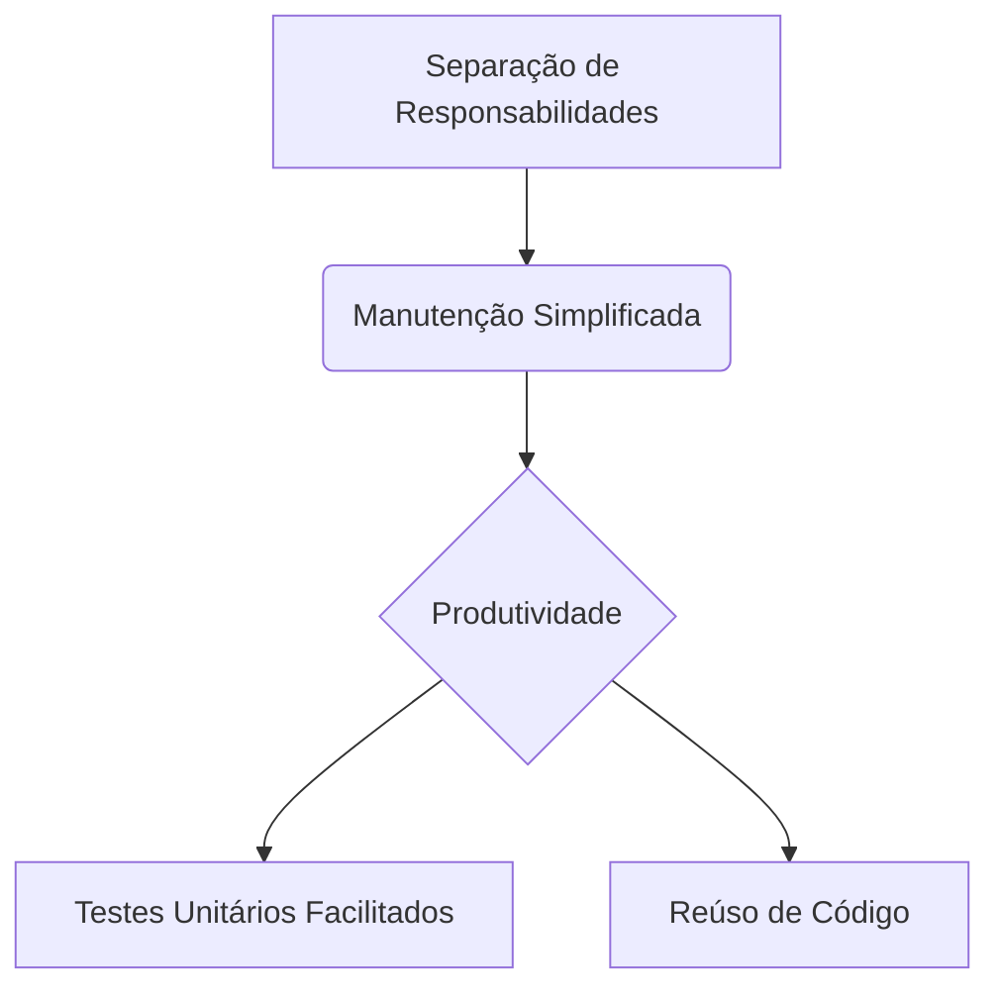

# 🏗️ Estrutura Padrão para Projetos C# 


Esta estrutura organiza um projeto C# de forma modular e escalável, seguindo boas práticas de desenvolvimento e separação de conceitos.

## 📂 Visão Geral da Estrutura

```text
📦 Solution
├── 📁 Apoio/          # Utilitários e infraestrutura
│   ├── 🧩 ConfigElementos.cs
│   ├── 🔠 Constantes.cs
│   └── 🛠️ Utils.cs
│
├── 📁 Bll/            # Camada de Lógica de Negócios
│   └── 💼 Bll.cs      # (Business Logic Layer)
│
├── 📁 Dal/            # Camada de Acesso a Dados
│   ├── 🗃️ Dal.cs      # (Data Access Layer)
│   └── 📂 ProjetoDal.cs
│
└── 📁 Dto/            # Objetos de Transferência
    └── 📦 Dto.cs      # (Data Transfer Objects)
```

🌟 Benefícios



🚀 Como Implementar para novas entidades:

📁 Bll/

      └── ClienteBll.cs   # Lógica específica de clientes


📁 Dal/

      └── ClienteDal.cs   # Persistência de clientes


📁 Dto/

      └── ClienteDto.cs   # Modelo de transferência
